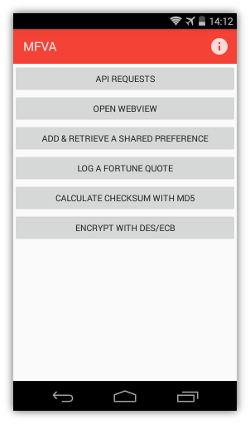
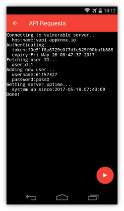

# mfva

[Download](https://github.com/viren-nadkarni/mfva/releases)

mfva is an Android app intentionally exhibiting vulnerabilities.

 

mfva has been designed as a demo app for the Appknox automated scanners. If it is not what you expected it to be, perhaps [DIVA](https://github.com/payatu/diva-android) is what you are looking for.

---

License: GPLv3
